# Browser File Manager 詳細設計書

## 目次

1. システム概要

2. システムフロー
   - 2.1 メインフロー
   - 2.2 ファイル操作フロー
   - 2.3 イベント処理フロー
     - 2.3.1 キーボードイベントフロー
     - 2.3.2 フォーカス管理フロー
     - 2.3.3 ペイン操作フロー
   - 2.4 UI更新フロー
   - 2.5 エラー処理フロー

3. 実装設計
   - 3.1 ディレクトリ構成
   - 3.2 モジュール依存関係
   - 3.3 初期化シーケンス
   - 3.4 エラーハンドリング実装

4. 状態管理
   - 4.1 アプリケーション状態
   - 4.2 エラー処理

5. セキュリティ考慮事項

6. パフォーマンス考慮事項

* * *

## 1. システム概要

Browser File Managerは、ブラウザベースの2画面の左右ペイン式ファイルマネージャーです。
キーボード操作を重視し、効率的なファイル管理を実現します。

システムファイルエリア以外で操作可能です。
※C:\直下やダウンロードフォルダ直下などでは、ブラウザのセキュリティ上ご使用ができません。

本フローチャートはAIで自動作成したものです。
一部存在しない機能や処理が含まれている可能性がありますが、目安資料として活用してください。

* * *

## 2. システムフロー

### 2.1 メインフロー

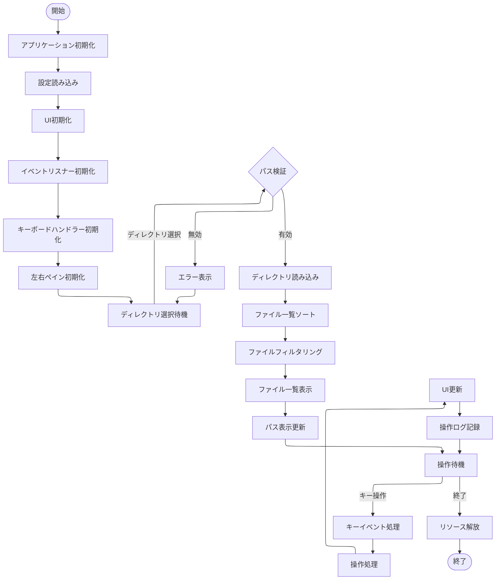

### 2.2 ファイル操作フロー

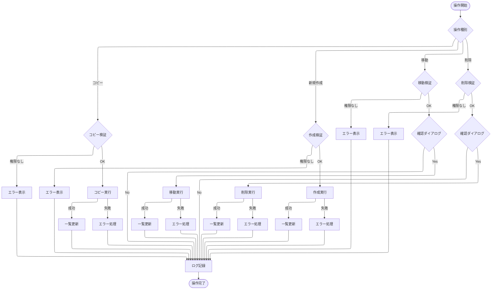

### 2.3 イベント処理フロー

#### 2.3.1 キーボードイベントフロー

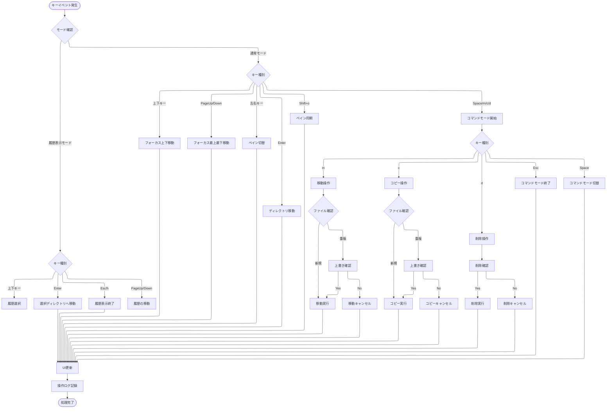

#### 2.3.2 フォーカス管理フロー

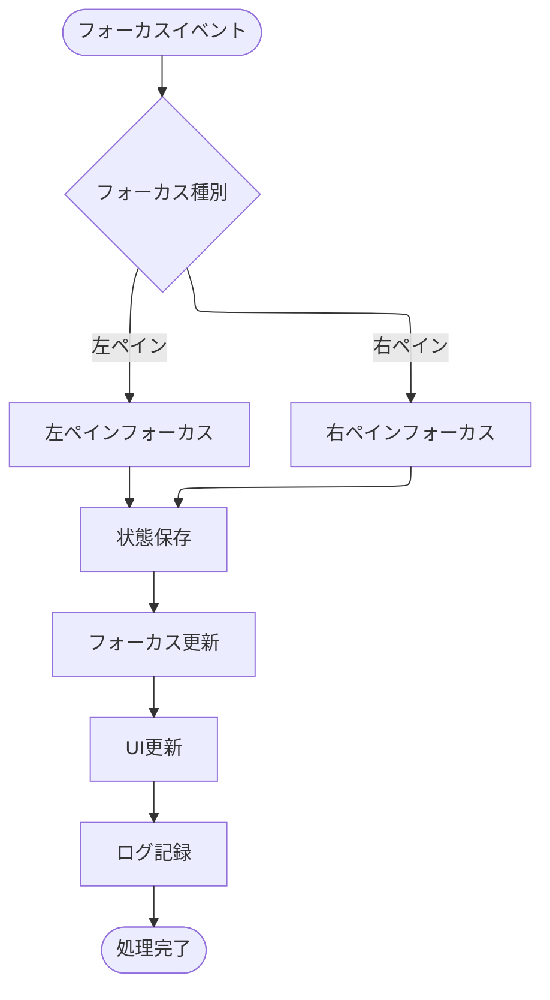

#### 2.3.3 ペイン操作フロー

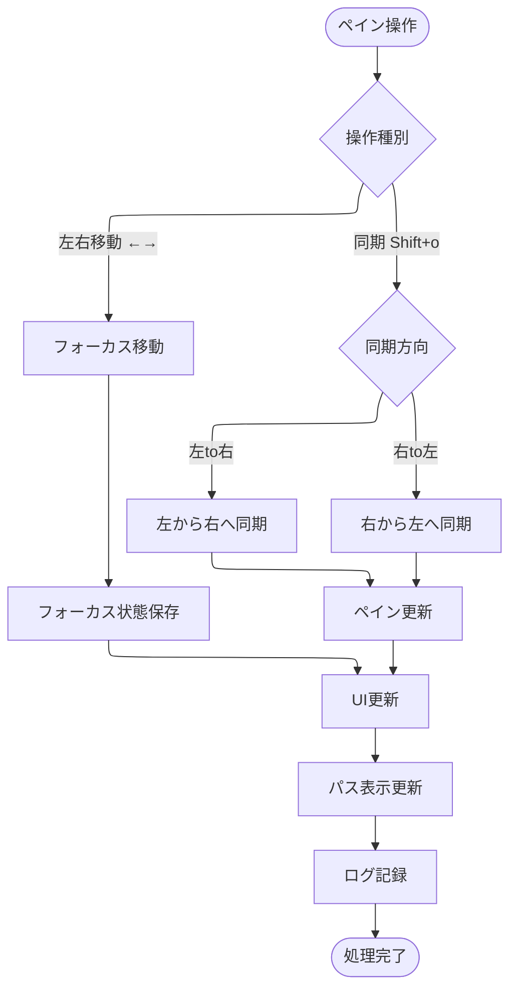

### 2.4 UI更新フロー

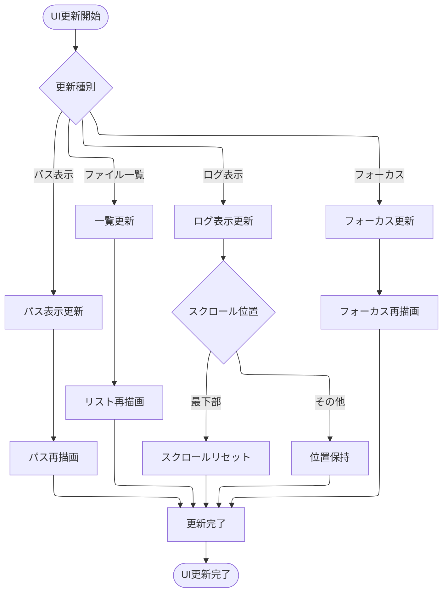

### 2.5 エラー処理フロー

* * *

## 3. 実装設計

### 3.1 ディレクトリ構成

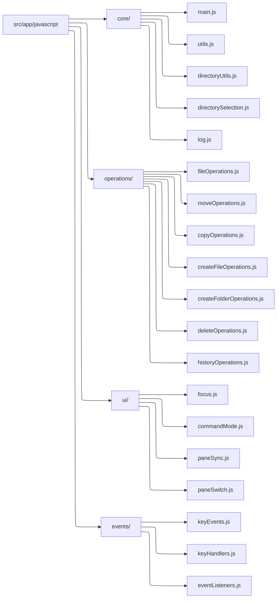

### 3.2 モジュール依存関係

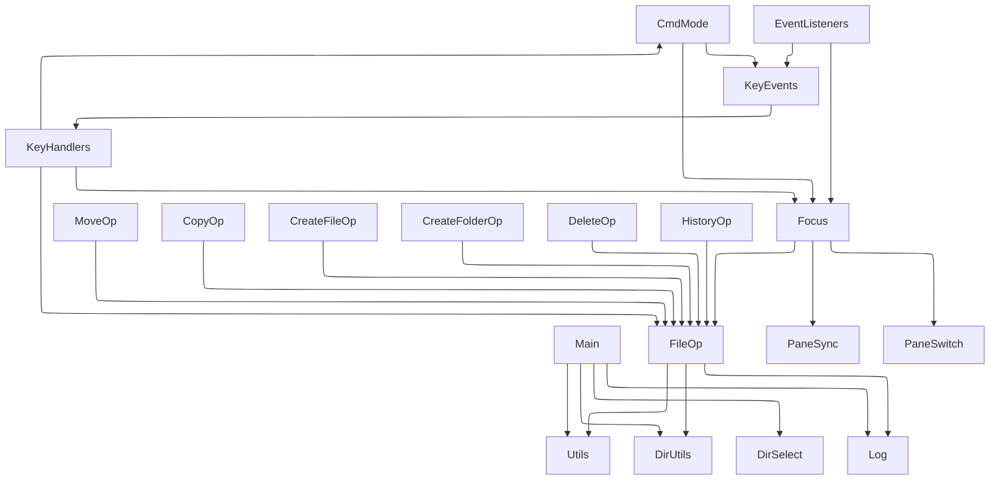

### 3.3 初期化シーケンス

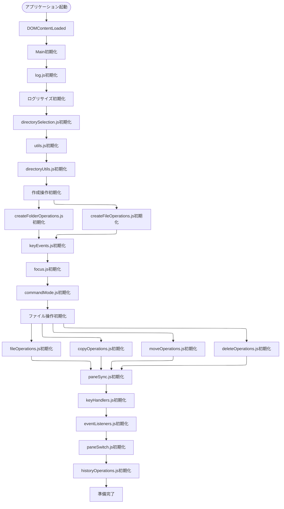

### 3.4 エラーハンドリング実装

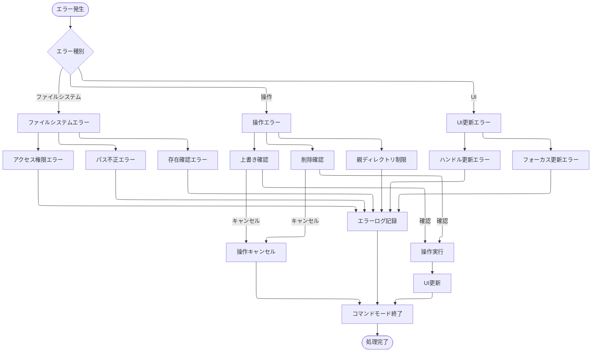

* * *

## 4. 状態管理

### 4.1 アプリケーション状態

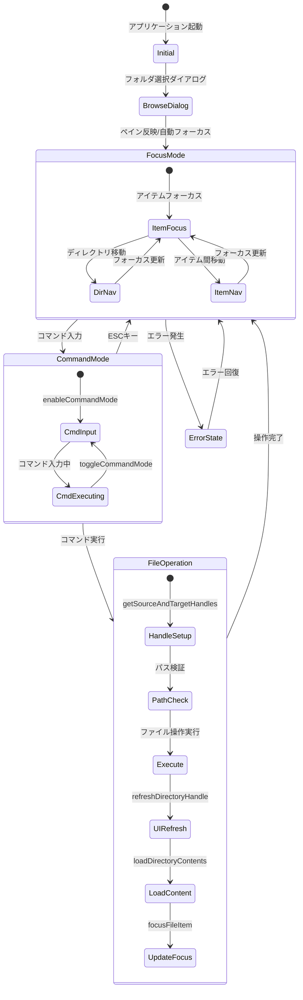

### 4.2 エラー処理

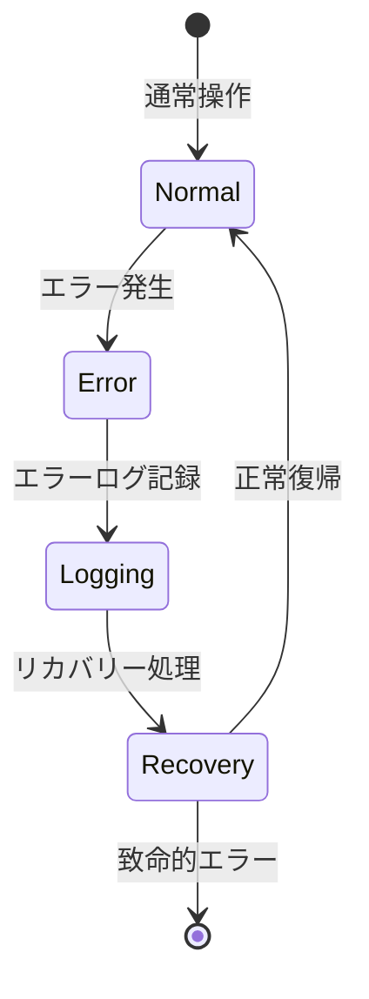

* * *

## 5. セキュリティ考慮事項

-   ファイルアクセス権限の確認
-   パス操作のバリデーション
-   エラー情報の適切な表示

* * *

## 6. パフォーマンス考慮事項

-   大規模ディレクトリの効率的な読み込み
-   UIの応答性確保
-   メモリ使用量の最適化